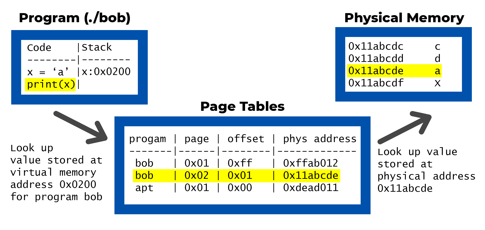
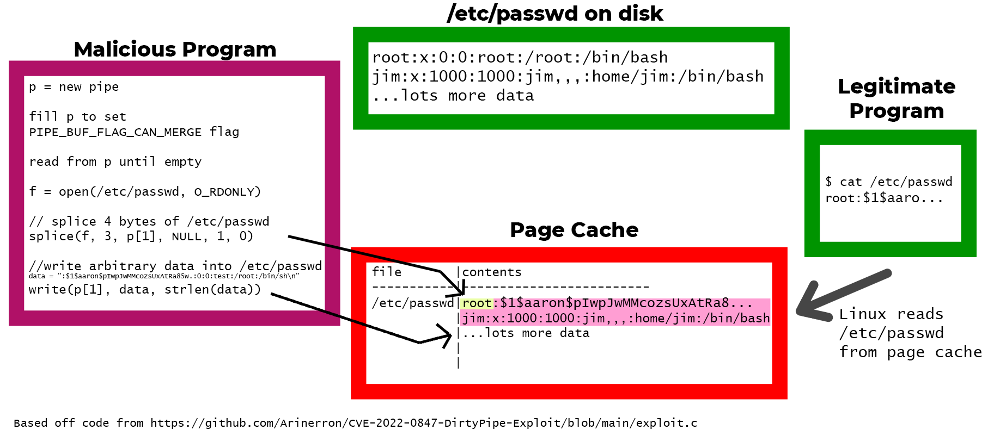

# Dirty Pipe Vulnerability

## Executive summary

CVE-2022-0847, also known as the Dirty Pipe Vulnerability, affects the Linux Kernel and allows read-only files to be overwritten by users that normally do not have that permission.[^Rasch]

This vulnerability is catastrophic. `/etc/passwd` is a read-only file that contains usernames and hashed passwords. [^Gite] An unprivileged user with the power to modify this file could set a new password for the root user and log in.

## Context

### Linux Memory Management

A program running in user space (i.e. everything that's not kernel code) uses **virtual memory addresses**. The set of virtual memory addresses available to each process is unique. Virtual memory addresses are mapped to physical addresses in page tables.

Pages are a fixed size: in order to find the physical address to access data stored in RAM, the system needs to know (1) which program's page table to look at, (2) which page to look at, and (3) where in the page to look (offset). The page and offset is encoded in the virtual memory address. [^Landley] Below is a simplified example:



### File I/O

When data is read from a file on a hard disk, the contents are copied to RAM. 

At first this data is written to kernel memory, not the user program's virtual memory. This allows for the kernel to cache the data: if this data is being read often, the kernel can reduce the amount of load on the hardware device with caching. Caching is handled by the **page cache** subsytem.

In many cases, the data is copied over to the user program's virtual memory, but if a user wants reduce the amount of data being copied, there are optimizations available. 

One such optimization exists when data is read from a file and sent to a pipe by program A (that will later be read by program B). In this case, copying the data to program A's userspace after reading the file is unnecessary. We can can circumvent doing this by directly passing around references to the page owned by page cache. [^Kellerman]

The `splice` Linux system call is built for developers that want to use this optimization:

> **splice**() moves data between two file descriptors without copying between kernel address space and user address space. It transfers up to *len* bytes of data from the file descriptor *fd_in* to the file descriptor *fd_out*, where one of the file descriptors must refer to a pipe. [^man-splice(2)]

### Pipe

Pipes are used for inter-process communication in Linux. Program A can push data to a pipe while Program B reads data from the pipe. A common example of using pipes in Linux on the command line is below:

```
cat test.txt | grep "james"
```

`cat` will read the contents of the file and dump them to the pipe, then`grep` will read from the pipe, find any lines that contain "james", and dump them to `stdout`

Under the hood, data is written to a pipe this way:

1. On the first write to the pipe, a page is allocated to the pipe buffer

2. If the page isn't full, subsquent writes to the pipe can append to that page (**except if it's the page cache, see note**)

3. Once the page is full, a new page is allocated [^Kellerman]

**Note:** Because the page cache could contain the cached versions of important files, it's critical not to let users append arbitrary data to pages there. 

### A bug in the pipe buffer

The pipe buffer has different flags, one of which (`PIPE_BUF_FLAG_CAN_MERGE`) allows for writing to an existing page. Unfortunately, a bug in the Linux kernel does not initialize the pipe buffer's flags in some circumstances. Because of this, by writing specialized data to the pipe, this flag can be set in situations where it shouldn't be set.[^redhat]

# Exploitation

## The key principles for exploitation

1. The page cache, from the operating system's perspective, is a trustworthy source of information about the contents of files stored on the hard disk.

2. `splice()` reads data from a file into the kernel's page cache. As long as this file stays in the cache, **other programs trying to access this file will read this cached version of this file.**

3. Then, `splice()` will create at least one `pipe_buffer`  that points to the page (or pages) in the page cache.

4. Because flags are accidentally uninitialized in the `pipe_buffer`, the `PIPE_BUF_FLAG_CAN_MERGE` flag can be set if special data is written to the buffer.

5. If `PIPE_BUF_FLAG_CAN_MERGE` is somehow set, and the user quickly writes their own data into the pipe, their data will be merged into most recently written page in the page cache.

6. This means that the page cache can be modified by a user with no special permissions.

## Step by step exploitation

2. Fill a pipe with data formatted in such a way that `PIPE_BUF_FLAG_CAN_MERGE` is set

3. Empty the pipe by reading from it

4. Use `splice()` to copy data from a target file to the pipe. (Don't copy the entire file: copy the file all the way up to one byte before you want to make changes.)

5. Write your own data to the pipe. Because `PIPE_BUF_FLAG_CAN_MERGE` has been set, the data you write to the pipe is merged into the page cache.



# Impact

### Affected devices

This vulnerability impacts Linux kernels released from Aug 2020 to Feb 2022.

Because Android devices ship with the Linux kernel, flagship devices from Google and Samsung were impacted. **Dirty Pipe was demonstrated giving a user a root shell** on a Pixel 6 Pro and Samsung S22 with a proof-of-concept sideloaded app. [^Bradshaw] 

A wide variety of other devices running Linux are also affected.  While patches have been released by all major Linux distributions, those that do not update remain vulnerable. Systems running Linux that are rarely or never updated (IoT, Routers, NAS) are of special attention.

### Is this being exploited?

This vulnerability was only disclosed March 7th, 2022. There have been no reports of this exploit being used in the wild. [^Bradshaw] However, due to the nature of this vulnerability (modifying caches), it can be difficult to detect as it can perform attacks without actually writing to the hard disk. [^Kellerman]

# Conclusion

It is very interesting to see a real example of the consequences of not initializing variables. Exploits relying on this were demonstrated in this class, and it is indicative of a larger problem in systems programming that these mistakes continue to happen.

This exploit is yet another that shows the advantages of programming languages (like Rust) that offer strong memory safety guarantees. Perhaps that's why Microsoft recommends using Rust for safe systems programming. [^MRSC__Team]

[^Rasch]: [How to Mitigate CVE-2022-0847 (The Dirty Pipe Vulnerability)](https://www.ivanti.com/blog/how-to-mitigate-cve-2022-0847-the-dirty-pipe-vulnerability)

[^Gite]: [Understanding /etc/passwd File Format - nixCraft](https://www.cyberciti.biz/faq/understanding-etcpasswd-file-format/)

[^Landley]: https://landley.net/writing/memory-faq.txt

[^Kellerman]: https://msrc-blog.microsoft.com/2019/07/22/why-rust-for-safe-systems-programming/https://dirtypipe.cm4all.com/

[^:man-splice(2)]: [splice(2) - Linux manual page](https://man7.org/linux/man-pages/man2/splice.2.html)

[^redhat]: [RHSB-2022-002 Dirty Pipe - kernel arbitrary file manipulation - (CVE-2022-0847) - Red Hat Customer Portal](https://access.redhat.com/security/vulnerabilities/RHSB-2022-002)

[^Bradshaw]: [Dirty Pipe: Pixel 6 &amp; Galaxy S22 affected by major exploit - 9to5Google](https://9to5google.com/2022/03/14/dirty-pipe-major-exploit-android-12-pixel-6-galaxy-s22/)

[^MRSC__Team]: [Why Rust for safe systems programming &#8211; Microsoft Security Response Center](https://msrc-blog.microsoft.com/2019/07/22/why-rust-for-safe-systems-programming/)
